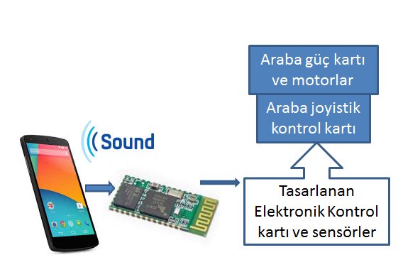
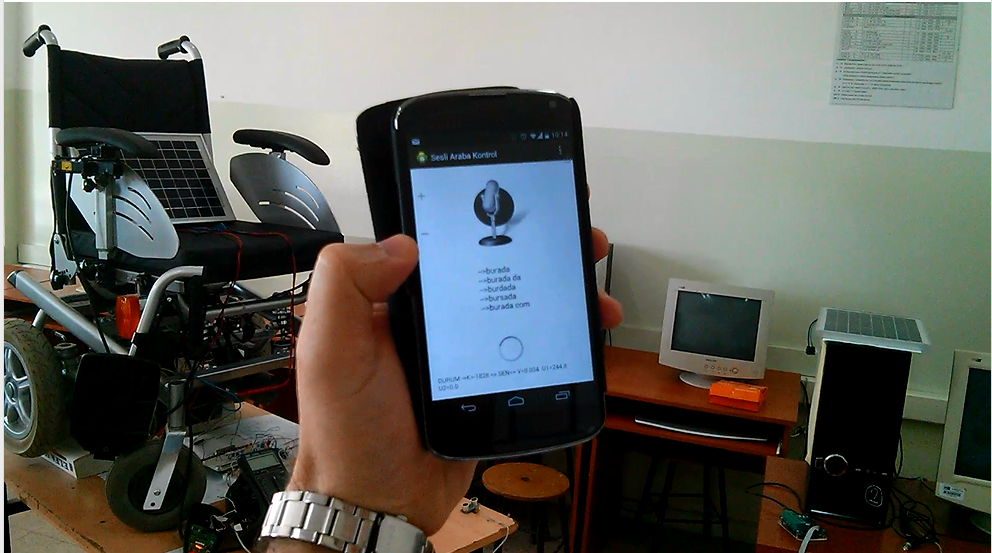
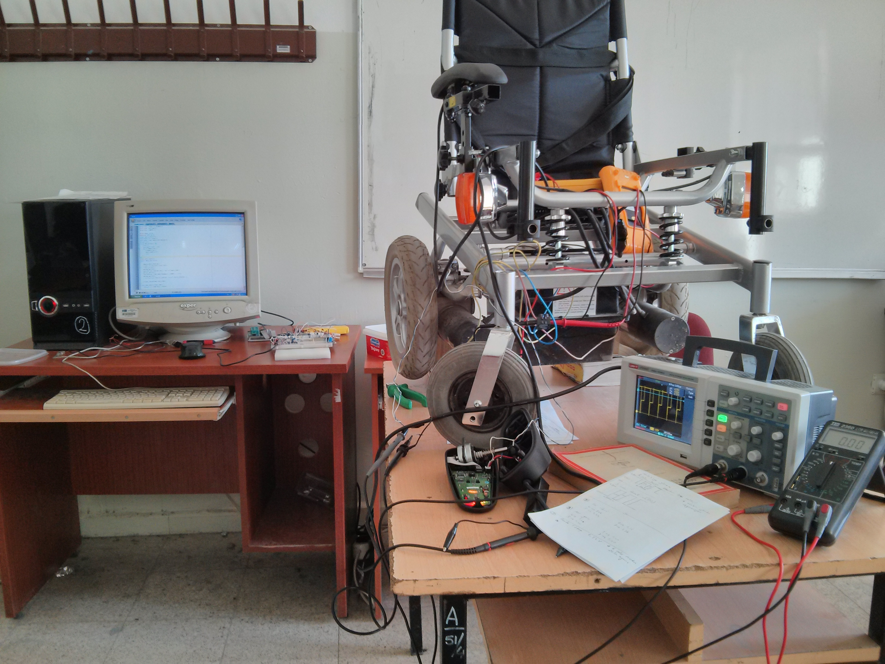

## **Voice Controlled Modified Disabled Car**

### Purpose of the Project :

Research and application of different control styles of the joystick controlled disabled car we have.

Especially to demonstrate voice controllability.

### **Method** :

-An application written in the Android operating system was used to detect and identify the voice commands given by the user. This application recognizes voice commands and sends the necessary commands to the electronic circuit via Bluetooth. The joystick was simulated on the electronic circuit and thus the car was steered.

- With the program written on the mobile phone, the commands given by voice or by pressing the buttons were detected and the car was controlled.

- Voice recognition in Android software requires an internet connection to interact with the Google voice recognition engine.

- With the designed electronic control card, control was carried out using voice commands along with the car's joystick. This structure enables alternative control methods without damaging the device's original circuits.

[Click for sample working video ...](https://www.youtube.com/watch?v=td3C3B1HCIA)

**Used Technologies :**

1. Microcontrollers, CCS PIC C (PIC24F)
2. Bluetooth communication.
3. PWM and motor controller.
4. Google Speech Recognition.
5. Android App programming

