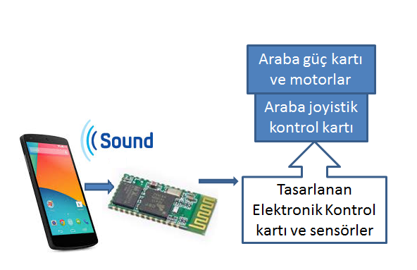

## **Sesle Kontrol Edilebilen Modifiye Edilmiş Engelli Arabası**

### Amaç :

Elimizde bulunan joyistik kontrollü engelli arabasının farklı kontrol biçimlerinin araştırılması ve uygulanması.

Özellikle de sesle kontrol edilebilirliğinin ortaya konulması.

### **Yöntem** :

- Kullanıcının vereceği ses komutlarının algılanıp tanımlanması için Android işletim sistemi  yüklü bir cep telefonu  haberleşme için de cep telefonunun bluetooth modülü kullanılmıştır.

- Cep telefonuna yazılan programla da sesli veya butonlara basılarak verilen komutlar algınmış ve araba kontrol edilmiştir.

- Yazılımda ses tanıma işlemi Google ses tanıma motoru ile gerçekleştiği için internet bağlantısına ihtiyaç vardır.

- Elektronik ses tanıma kartları kullanılarak cep telefonu ve internet bağlantı ihtiyacı ortadan kaldırılabilir.
- Tasarlanan elektronik kontrol kartı ile arabanın joyistiği ile beraber sesli komutlarla kontrol işlemi gerçekleştirilmiştir.  Bu yapıyla da arabanın kendi orijinal devrelerine zarar verilmeden alternatif kontrol yöntemlerine olanak sağlanmıştır.

**Kullanılan Teknolojiler :**

1. CCS PIC C 
2. Bluetooth haberleşme.
3. PWM sinyaller.
4. Google ses tanıma.
5. Android Programlama 

Not : Sadece elektronik devvre paylaşılmıştır.